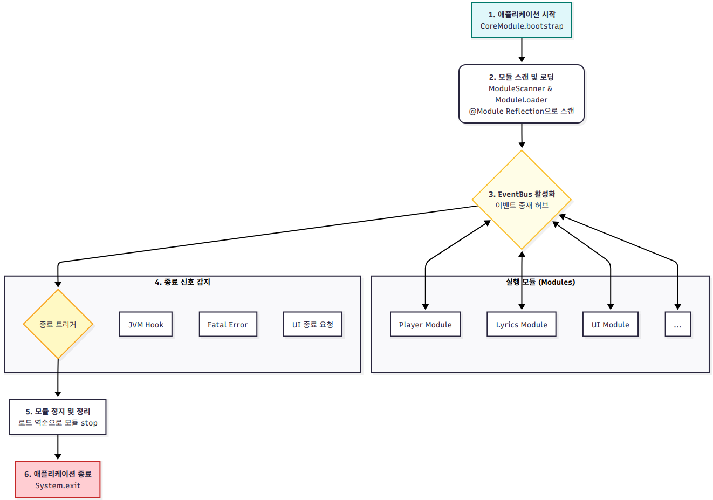

# OOP 1팀 SyncTune 프로젝트

## 역할 분담
팀원: 동헌희, 김민재, 김대영, 임민수

* 전체 설계 및 문서화: 동헌희
* 주제 발표 및 모듈 구조 설계: 동헌희
* GitHub Actions 설정 및 CI/CD 파이프라인 구축: 동헌희
* 프로젝트 최종 발표: (발표자 미정)
* `sdk` 모듈 개발: 동헌희
* `core` 모듈 개발: 동헌희
* `player` 모듈 개발: 김민재
* `lyrics` 모듈 개발: 김대영
* `ui` 모듈 개발: 임민수

## 프로젝트 개요

확장 가능하고 유지보수가 용이한 음악 플레이어 `SyncTune`을 개발하는 것을 목표로 합니다.

단순히 음악을 재생하는 기능을 넘어, SOLID 원칙과 디자인 패턴을 적용하여 각 기능이 독립적으로 작동하고, 새로운 기능을 쉽게 추가하거나 기존 기능을 수정할 수 있는 견고한 아키텍처를 설계하고 구현하는 데 중점을 두었습니다.
## 프로젝트 구조
자세한 설계 문서는 [docs/Design.md](docs/Design.md)에서 확인할 수 있습니다.
### 모듈 구조
모듈 문서와 코드는 다음 위치에서 확인할 수 있습니다.
- `sdk`: [SDK 모듈 문서](docs/SDK.md), [SDK 모듈 위치](sdk/src/main/java/ac/cwnu/synctune/sdk)
- `core`: [Core 모듈 문서](docs/core.md), [Core 모듈 위치](core/src/main/java/ac/cwnu/synctune/core)
- `player`: (없음), [Player 모듈 위치](player/src/main/java/ac/cwnu/synctune/player)
- `lyrics`: (없음), [Lyrics 모듈 위치](lyrics/src/main/java/ac/cwnu/synctune/lyrics)
- `ui`: (없음), [UI 모듈 위치](ui/src/main/java/ac/cwnu/synctune/ui)
- `stub`: 테스트용 스텁 모듈로, 실제 기능은 구현되어 있지 않습니다.

## 아키텍처 설계 목표 및 철학
"어떻게 하면 각 팀원이 맡은 파트(Player, UI, Lyrics)를 독립적으로 개발하면서도, 시스템 전체가 유기적으로 협력하게 만들 수 있을까?"라는 질문에서 설계를 시작했습니다.

이를 위해 다음과 같은 설계 목표를 설정했습니다.

- **높은 응집도:** 관련된 기능은 하나의 모듈 안에 모으고, 각 모듈은 자신만의 책임에만 집중하도록 합니다. (`player`는 재생, `ui`는 화면, `lyrics`는 가사)
- **느슨한 결합:** 모듈 간의 직접적인 의존성을 제거합니다. UI 모듈이 Player 모듈의 특정 클래스나 메서드를 직접 호출하는 일이 없도록 설계하여, 한 모듈의 변경이 다른 모듈에 미치는 영향을 최소화합니다.
- **확장성:** 새로운 기능(예: 이퀄라이저, 온라인 가사 검색)을 추가할 때, 기존 코드를 수정하는 것이 아니라 새로운 '모듈'을 추가하는 방식으로 시스템을 확장할 수 있도록 합니다.

이러한 목표를 달성하기 위해 **플러그인 방식의 모듈 구조**와 **이벤트 기반 아키텍처** 를 채택했습니다.

*시스템의 Core 모듈이 다른 기능 모듈들을 어떻게 관리하고 통신을 중재하는지 단순화한 구조입니다.*

## 핵심 설계 결정 및 객체지향 원칙 적용

### 모듈화와 단일 책임 원칙, 개방-폐쇄 원칙

- **원칙 적용:** 각 주요 기능(`player`, `lyrics`, `ui`)을 별도의 모듈로 분리하여 단일 책임 원칙을 준수했습니다. `PlayerModule`은 오직 '재생'에 관한 책임만 가지며, `UIModule`은 '사용자 인터페이스'에 대한 책임만 집니다.
- **구현 방식:**
    - 모든 모듈은 `sdk`의 `SyncTuneModule` 추상 클래스를 상속받아 일관된 생명주기(`start()`, `stop()`)를 갖습니다.
    - `core` 모듈의 `ModuleScanner`는 `@Module` 어노테이션을 통해 이 모듈들을 동적으로 발견하고, `ModuleLoader`가 이를 로드합니다.
- **기대 효과:** 이 구조 덕분에 개방-폐쇄 원칙을 만족합니다.  
                 예를 들어, 새로운 '팟캐스트 재생 모듈'을 추가하고 싶을 때, 기존의 `core`나 `player` 코드를 전혀 수정할 필요 없이, `PodcastModule`을 새로 만들어 프로젝트에 추가하기만 하면 시스템이 자동으로 인식하고 확장됩니다.

### 이벤트 기반 통신과 의존관계 역전 원칙

- **원칙 적용:** 모듈 간의 직접적인 참조를 없애기 위해 `EventBus`를 중심으로 한 발행-구독(Publish-Subscribe) 패턴을 도입했습니다. 
                이를 통해 의존관계 역전 원칙을 실현할 수 있었습니다. 
                모듈들은 구체적인 다른 모듈에 의존하는 것이 아니라, `BaseEvent`라는 추상 이벤트 클래스와 `EventPublisher` 인터페이스에만 의존합니다.
- **구현 방식:**
    - `ui` 모듈에서 사용자가 재생 버튼을 누르면, `new PlayerModule().play()`를 호출하는 대신 `publish(new RequestPlayEvent())`를 호출합니다.
    - `player` 모듈은 `@EventListener`를 통해 `RequestPlayEvent`를 구독하고 있다가, 이벤트를 수신하면 자신의 재생 로직을 수행합니다.
- **기대 효과:** `ui` 모듈은 "누가" 재생을 처리하는지 전혀 알 필요가 없습니다. 이는 극단적인 수준의 디커플링(Decoupling)을 가능하게 하여, 각 모듈의 독립적인 개발, 테스트, 교체를 용이하게 만듭니다.

### 상속과 추상화를 통한 확장성

- **원칙 적용:** 공통된 규약을 정의하기 위해 추상화를 적극적으로 활용해 리스코프 치환 원칙을 만족했습니다.
- **구현 방식:**
    - `SyncTuneModule` (추상 클래스): 모든 모듈이 반드시 지켜야 할 계약(`start()`, `stop()`)을 정의합니다. 
                        `CoreModule`은 모든 모듈을 구체적인 `PlayerModule`이나 `UIModule`이 아닌, 추상적인 `SyncTuneModule` 타입으로 다룰 수 있습니다.
    - `BaseEvent` (추상 클래스): 모든 이벤트가 공통적으로 가져야 할 속성(e.g., `timestamp`)을 정의합니다. 
                              `EventLogger`는 모든 이벤트를 `BaseEvent` 타입으로 받아 일괄적으로 처리할 수 있습니다.
- **기대 효과:** 코드의 재사용성을 높이고, 시스템 전체에 일관성을 부여하며, 새로운 모듈이나 이벤트 타입을 추가할 때 따라야 할 명확한 설계를 제공합니다.

### 정보 은닉과 캡슐화

- **원칙 적용:** 각 모듈은 내부의 복잡한 구현 세부사항을 외부로부터 완벽하게 숨기고, 오직 잘 정의된 이벤트 인터페이스를 통해서만 상호작용합니다.
- **구현 방식:**
    - `player` 모듈의 `AudioEngine`이나 `PlaybackStateManager`는 `player` 모듈 외부에서 절대 직접 접근할 수 없습니다. 즉, 완전히 캡슐화되어 있습니다.
    - 외부 모듈은 `player` 모듈이 `javax.sound`를 쓰는지, `JavaFX Media`를 쓰는지 전혀 알 수 없고, 알 필요도 없습니다. 이는 내부 구현 기술을 변경하더라도 다른 모듈에 영향을 주지 않음을 의미합니다.
- **기대 효과:** 모듈의 독립성과 응집도를 높여 유지보수를 매우 쉽게 만듭니다. 버그가 발생했을 때 문제의 원인을 특정 모듈 내부로 한정하기 용이합니다.
