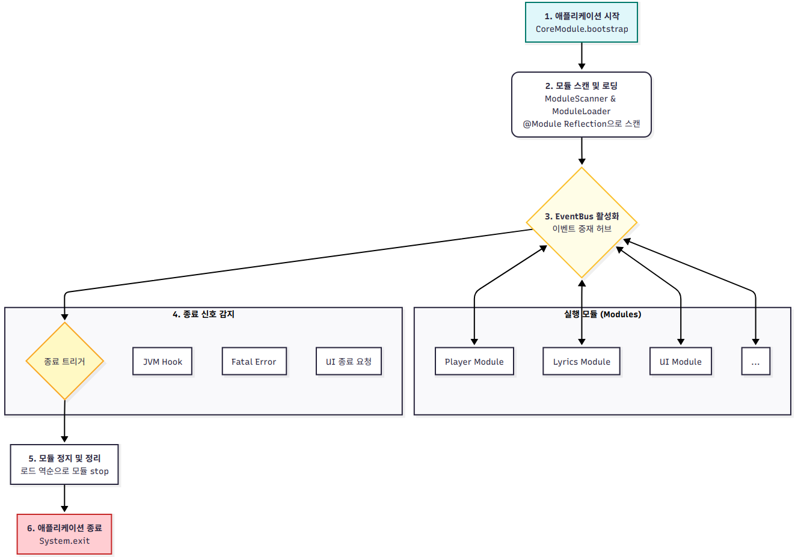

# Core Module

`core` 모듈은 SyncTune 애플리케이션의 전체 생명주기(시작, 실행, 종료)를 관리하고, 다른 모든 기능 모듈(Player, Lyrics, UI 등)을 동적으로 찾아 로드하며, 모듈 간의 통신을 중재하는
핵심 로직을 담고 있습니다.

## Core Module Lifecycle

`core` 모듈은 애플리케이션의 시작부터 종료까지 전체 과정을 조율합니다. 이 과정은 다음과 같이 요약할 수 있습니다.

1. 애플리케이션 시작: `Main` 클래스에서 `CoreModule.bootstrap()`을 호출하여 전체 시스템을 부트스트랩합니다. 이 과정에서 처리되지 않은 예외를 잡기 위한
   `GlobalExceptionHandler`가 등록됩니다.
2. 모듈 스캔 및 로딩: `ModuleScanner`가 클래스패스에서 `@Module` 어노테이션이 붙은 모든 `SyncTuneModule` 구현체를 찾습니다. 그 후 `ModuleLoader`가 스캔된 모듈들을
   순차적으로 인스턴스화하고, `start()` 메서드를 호출하여 초기화합니다.
3. EventBus 활성화 및 실행: 모든 모듈의 로딩과 시작이 완료되면 `EventBus`를 통해 모듈 간의 통신이 가능해집니다. 각 모듈은 `EventBus`에 리스너(`@EventListener`)를 등록하여
   다른 모듈에서 발생하는 이벤트를 구독하고, `EventPublisher`를 통해 자신의 이벤트를 발행합니다. 애플리케이션은 이 이벤트 기반 아키텍처를 통해 유기적으로 동작합니다.
4. 종료 신호 감지: 애플리케이션은 여러 경로로 종료 신호를 받을 수 있습니다.
    * JVM Hook: 사용자가 프로그램을 강제 종료(Ctrl+C 등)하거나 더 이상 non-Daemon Thread가 없을 때 JVM에 의해 트리거됩니다.
    * Fatal Error: `OutOfMemoryError`와 같이 복구 불가능한 오류가 발생했을 때 `GlobalExceptionHandler` 또는 `FatalErrorReporter`에 의해
      트리거됩니다.
    * UI 종료 요청: 사용자가 UI의 닫기 버튼을 누를 때 `PlayerUIEvent.MainWindowClosedEvent` 또는
      `SystemEvent.RequestApplicationShutdownEvent`를 통해 트리거됩니다.
5. 모듈 정지 및 정리: 종료 신호가 감지되면 `CoreModule`은 로드했던 모듈들을 로드의 역순으로 `stop()` 메서드를 호출하여 안전하게 정리합니다. 
   이는 의존성이 있는 모듈이 먼저 정리되는 것을 방지합니다.
6. 애플리케이션 종료: 모든 모듈이 성공적으로 정지되면, `EventBus`의 스레드 풀을 종료하고 등록된 JVM Shutdown Hook을 해제한 후 `System.exit()`를 호출하여 프로세스를 완전히
   종료합니다.

## 주요 구성 요소

### `ac.cwnu.synctune.core/CoreModule.java`

애플리케이션의 중앙 제어 타워 역할을 하는 싱글톤 클래스입니다. `SyncTuneModule`을 상속하며, `ModuleLifecycleListener`와 `EventPublisher`를 구현합니다.

* 주요 책임:
    * 애플리케이션 부트스트래핑: `bootstrap()` 정적 메서드를 통해 애플리케이션을 시작합니다.
    * 모듈 관리: `ModuleScanner`와 `ModuleLoader`를 사용하여 다른 모듈들을 스캔, 로드, 시작, 중지합니다.
    * 생명주기 관리: JVM Shutdown Hook을 등록하여 예기치 않은 종료 시에도 `stop()` 메서드가 호출되도록 보장합니다. 
      `ModuleLifecycleListener`를 구현하여 다른 모듈의 생명주기 변경을 로깅합니다.
    * 이벤트 발행: `EventPublisher`를 구현하여 시스템 전체에 이벤트를 발행합니다. 이 인스턴스는 각 모듈의 `start()` 메서드로 전달됩니다.
    * 핵심 이벤트 구독: `SystemEvent.RequestApplicationShutdownEvent`를 수신하여 정상 종료 절차를 시작하고, `ErrorEvent`를 수신하여 치명적인 오류 발생 시
      `FatalErrorReporter`를 호출합니다.

### `ac.cwnu.synctune.core/EventBus.java`

모듈 간의 통신을 담당하는 이벤트 중재자입니다. Publish-Subscribe 패턴을 구현합니다.

* 주요 기능:
    * 리스너 등록/해제: `@EventListener` 어노테이션이 붙은 메서드를 찾아 해당 이벤트 타입의 리스너로 등록(`register`)하거나 해제(`unregister`)합니다.
    * 이벤트 발행: `post()` 메서드를 통해 `BaseEvent`를 발행하면, 해당 이벤트 타입 또는 그 상위 타입을 구독하는 모든 리스너에게 이벤트를 전달합니다.
    * 동기/비동기 처리: 생성자 인자를 통해 이벤트 처리를 동기적(발행 스레드에서 즉시 실행) 또는 비동기적(별도의 스레드 풀에서 실행)으로 수행할지 결정할 수 있습니다. 
      현재는 비동기로 설정되어 UI 블로킹을 방지합니다.
    * 예외 처리: 리스너 메서드 실행 중 예외가 발생하면, 이를 잡아 `ErrorEvent`로 다시 발행하여 시스템 전체에 오류 상황을 알립니다. 
      (단, `ErrorEvent` 처리 중 발생하는 예외는 무한 루프를 막기 위해 다시 발행하지 않습니다.)

### `ac.cwnu.synctune.core.initializer` 패키지

모듈을 동적으로 로드하고 관리하는 역할을 합니다.

* `ModuleScanner.java`: `org.reflections` 라이브러리를 사용하여 클래스패스에서 `@Module` 어노테이션이 붙고 `SyncTuneModule`을 상속하는 모든 클래스를 찾아냅니다. 
  `CoreModule` 자신은 이 스캔 결과에서 제외됩니다.
* `ModuleLoader.java`: `ModuleScanner`가 찾은 클래스들을 인스턴스화하고, `start()`와 `stop()` 메서드를 호출하여 모듈의 생명주기를 관리합니다. 
  모듈 로딩 및 시작 과정에서 발생하는 모든 예외를 처리하여 `ErrorEvent`로 발행하며, 치명적인 경우 `ModuleInitializationException`을 발생시켜 시스템 시작을 중단시킵니다. 
  또한, 등록된 `ModuleLifecycleListener`들에게 각 생명주기 단계(로드 전/후, 시작 전/후 등)를 알립니다.

### `ac.cwnu.synctune.core.error` 패키지

애플리케이션의 안정성을 높이기 위한 중앙 집중식 예외 처리 메커니즘을 제공합니다.

* `GlobalExceptionHandler.java`: `Thread.UncaughtExceptionHandler`를 구현하며, `Thread.setDefaultUncaughtExceptionHandler`를
  통해 모든 스레드에서 처리되지 않은 예외를 가로챕니다. 예외가 `VirtualMachineError`와 같이 복구 불가능한 치명적 오류인 경우 `FatalErrorReporter`에 보고하고, 그 외의 경우에는
  non-fatal `ErrorEvent`를 발행하여 시스템에 알립니다.
* `FatalErrorReporter.java`: 시스템을 안전하게 종료하는 마지막 Fail-safe Logic 입니다. 치명적인 오류가 보고되면, `CoreModule`의 `stop()` 메서드를 별도의 스레드에서 호출하여 정상적인
  리소스 정리를 시도합니다. 만약 이 과정이 지정된 시간 내에 완료되지 않거나 실패하면 `System.exit(1)`을 통해 애플리케이션을 강제로 종료하여 비정상적인 상태가 유지되는 것을 방지합니다. 
* `ModuleInitializationException.java`: 모듈 로딩 또는 시작 중에 심각한 문제가 발생했을 때 `ModuleLoader`가 발생시키는 커스텀 `RuntimeException`입니다.

### `ac.cwnu.synctune.core.logging` 패키지

* `EventLogger.java`: 디버깅을 위한 간단한 유틸리티 클래스입니다. `BaseEvent`를 구독하여 발생하는 모든 이벤트를 DEBUG 레벨로 로깅합니다. 이를 통해 애플리케이션의 이벤트 흐름을 쉽게
  추적할 수 있습니다.